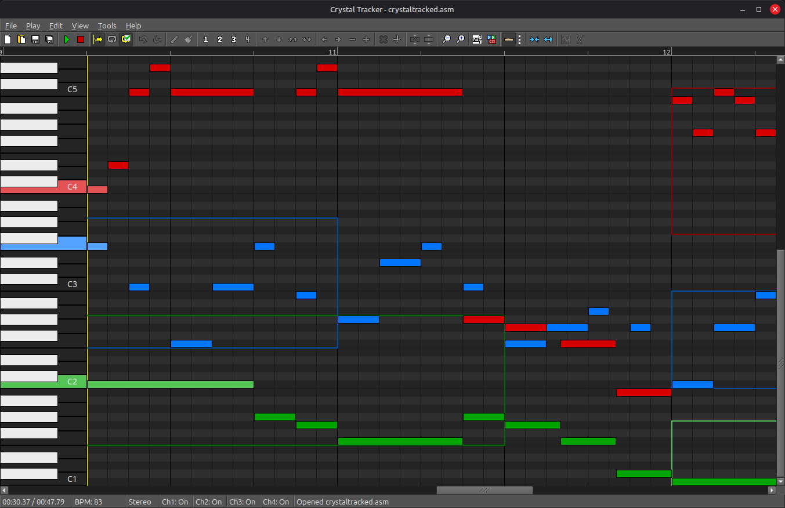

# Crystal Tracker

A song and sound editor for [pokecrystal](https://github.com/pret/pokecrystal), [pokegold](https://github.com/pret/pokegold), [pokeyellow-crysaudio](https://github.com/dannye/pokeyellow-crysaudio), [pokered-crysaudio](https://github.com/dannye/pokered-crysaudio), and [pokepinball](https://github.com/pret/pokepinball).

Crystal Tracker provides the ability to directly create and modify pokecrystal-based asm song files, with in-app immediate playback by dynamically loading and synthesizing custom channel 3 waveforms and channel 4 drumkits.

The editor exports fully complete asm song files, so that you can "Save" your changes and then immediately `make` your project and instantly have a new ROM file with your modifications included — no additional conversion tools or steps required.



## Getting Started

### Windows

Download the latest Windows executable from the [Releases](https://github.com/dannye/crystal-tracker/releases) section.
To build from source, see [INSTALL.md](INSTALL.md).

---

### Linux

See [INSTALL.md](INSTALL.md) to build from source or run the Windows executable via Wine.

---

### Mac

Download the latest dmg from the [Releases](https://github.com/dannye/crystal-tracker/releases) section or run the Windows executable via Wine.
To build from source, follow the Linux instructions in [INSTALL.md](INSTALL.md) plus a dash of common sense (ie, perhaps use clang++ in place of g++-8 if building libopenmpt from source).

---

The [example/](example/) directory contains crystaltracked.asm, an original composition by Mickey-A 42.

Be sure to see the Help menu for a full explanation on how to use the editor.

## What Crystal Tracker doesn't do well, yet

This editor is still a WIP. Some of the most notable missing features are:
* Creation and deletion of inner loops and calls
* Copy & Paste

## Upgrading a legacy project

If your project uses the "legacy" macros (pre-2020), you will need to upgrade your project.

Download [tools/upgrade.py](tools/upgrade.py) and put it at the root of your project.
Run the upgrade script on your music folder, like:
```sh
python3 upgrade.py -v audio/music/
```
It can also be used to upgrade individual files, like:
```sh
python3 upgrade.py -v audio/drumkits.asm
```
The script also works with python2. Run `./upgrade.py -h` for all options.

Be sure to make adequate backups of your song files (via git or otherwise) before upgrading, just in case.

Then you must copy all modern audio macros from the latest [macros/scripts/audio.asm](https://github.com/pret/pokecrystal/blob/master/macros/scripts/audio.asm) and [macros/legacy.asm](https://github.com/pret/pokecrystal/blob/master/macros/legacy.asm) into your project.

## Special Thanks

This project takes a lot of inspiration (and a lot of backbone code structure) from [Polished Map](https://github.com/Rangi42/polished-map). A huge thank you to [Rangi42](https://github.com/Rangi42)!

Additional thanks to [mid-kid](https://github.com/mid-kid) for the Mac port.
